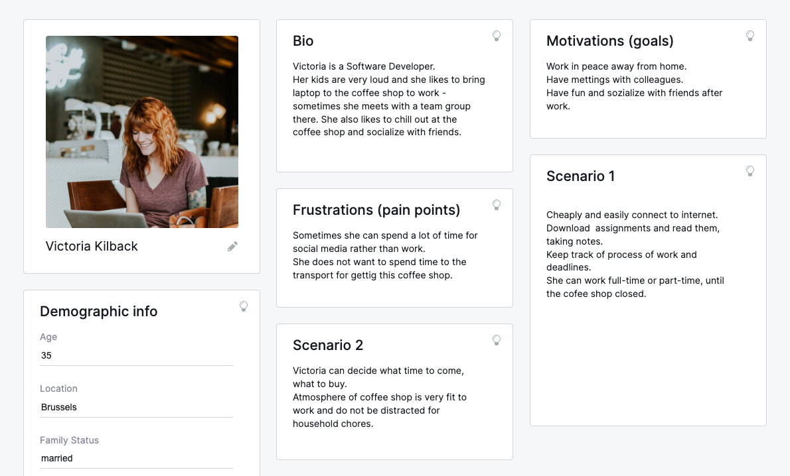

# User Personas

**The project objective** : To work as a group for practicing `Separation of concerns`

## Software developer

- **Bio**: Victoria is 35 years old Middle Software developer.
- **Needs/Goals**: Work in peace away from home, cause she is working remotely;
Have a meeting with team; Have fun and socialize with friends.
- **Frustrations**: Spend time for transport and money for coffee shop.
- **Scenario 1**: Cheaply and easy connect ot Internet, keep track of work and
deadlines, working in comfort coffee shop.

